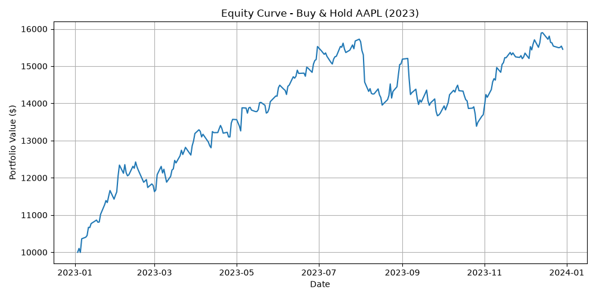

# Custom Backtesting Engine & Strategy Lab

A backtesting engine built from scratch in Python — no `backtrader`, no `zipline`, no `bt`. The point isn't to reinvent those libraries, it's to actually understand what a backtester is doing under the hood: order execution, position tracking, and (eventually) the risk metrics everyone quotes without knowing how they're computed.

This is part of a 5-project, 5-month portfolio. Project 1 was a neural network from scratch; this one moves into quant finance.

## Status

Week 1 complete. Week 2: 4 strategies built (buy-and-hold, SMA crossover, RSI mean-reversion, momentum breakout), commission + slippage modeling added. Position sizing remaining for Week 2.

## Results so far

All results: AAPL, 2023, $10,000 starting cash, $1 commission per trade, 0.1% slippage per trade.

| Strategy | Final Value | Return | Trades |
|---|---|---|---|
| Buy & Hold | $15,443.12 | +54.4% | 1 |
| SMA Crossover (20/50) | $12,128.45 | +21.3% | 8 |
| RSI Mean-Reversion (14, 30/70) | $11,138.96 | +11.4% | 4 |
| Momentum Breakout (20-day) | $10,849.52 | +8.5% | 7 |



**Every active strategy underperformed buy-and-hold, and the gap widened slightly once slippage was added** — the strategies that trade more (SMA: 8 trades, Momentum: 7 trades) lost more to slippage than the ones that trade less (Buy & Hold: 1 trade). Slippage costs scaled roughly proportionally with trade count (~$10 per trade regardless of strategy), confirming the model is working as intended, not just adding noise.

This is a specific, understandable result about this market regime, not a general verdict on active trading:

- 2023 AAPL was a strong, fairly persistent uptrend with relatively few deep pullbacks — close to the best-case scenario for buy-and-hold and the worst-case scenario for strategies that enter and exit.
- Every active strategy pays commission and slippage on every round-trip trade, both of which buy-and-hold largely avoids by only trading once.
- Each active strategy risks being *out* of the market during part of the rally — buy-and-hold can't miss any of it, by construction.

**What this result does NOT yet show:** whether these strategies took on less risk to get their (lower) returns. Week 3's risk-adjusted metrics (Sharpe ratio, max drawdown) will give a fairer comparison than raw final value. Testing across a choppier/sideways period and other tickers is also planned.

## What's built so far

- **`engine/data_loader.py`** — pulls daily OHLCV data via `yfinance`, caches it locally as CSV.
- **`engine/order.py`** — validated trade instruction (dataclass).
- **`engine/portfolio.py`** — cash, positions, trade log, and total value tracking.
- **`engine/broker.py`** — validates and executes orders. Models slippage: the actual fill price is slightly worse than the quoted price (higher on a buy, lower on a sell), simulating the real cost of an order moving the price against you. Simple percentage-based model — not a full order-book simulation, but a standard, honest first-pass approximation.
- **`engine/backtester.py`** — the event loop, with a `prepare_fn` hook for precomputing indicator columns (lookahead-safe via `pandas.rolling()`) and a `slippage_pct` parameter passed through to the Broker.
- **`strategies/buy_and_hold.py`** — baseline. Buys once, holds.
- **`strategies/sma_crossover.py`** — trend-following. Buy/sell on moving-average crossovers.
- **`strategies/rsi_strategy.py`** — mean-reversion. Buy oversold (RSI<30), sell overbought (RSI>70).
- **`strategies/momentum_breakout.py`** — buys on breakout above N-day high, sells below N-day low. Uses `.shift(1)` to avoid comparing today's price to a window that includes itself.

Bugs hit and fixed across sessions: multiple typos (`curent_prices`, `perpare`, a missing `df` prefix), a stray autocomplete import masking a misspelled loop variable, a 0-byte unsaved file, a dict key naming mismatch. All caught by running the code and checking against expected/hand-calculated numbers, not assumed to work.

## Tickers

SPY, AAPL, MSFT, GOOGL, JPM — a mix of index ETF, tech megacaps, and financials, so results aren't just "does this work when tech goes up."

## Setup

```bash
python -m venv venv
venv\Scripts\Activate.ps1   # Windows
pip install -r requirements.txt
python main.py
```

## Notes and derivations

`derivations.md` has photographed handwritten notes (finance terms, hand-worked calculations, architecture design, the RSI formula, the breakout `.shift(1)` reasoning, slippage cost math) paired with typed explanations, day by day.

## Why build the engine instead of using a library

Most student "algo trading" projects call `backtrader` or `zipline`, plot one equity curve, and call it done. That tests whether you can read documentation, not whether you understand what's happening between a signal and a filled trade — slippage, commissions, position sizing, what happens when you try to sell something you don't hold. Building it myself means I have to make those decisions explicitly instead of inheriting someone else's defaults.

## Known limitations (will grow as the project does)

- No position sizing yet — every strategy bets 100% of available cash on each trade, all-or-nothing
- Slippage model is a flat percentage, not dependent on order size, liquidity, or volatility — a known simplification
- Single-asset backtests only so far
- Only tested on one ticker, one year, one market regime (a strong uptrend) — the underperformance of all 3 active strategies is a hypothesis about that regime, not a general conclusion
- No risk-adjusted metrics yet (Sharpe, drawdown) — this is the biggest open gap in the current comparison
- RSI here uses simple rolling averages, not Wilder's exponential smoothing
- The event loop is *designed* to avoid lookahead bias by only exposing past-and-current data to the strategy, but I haven't written an active test that tries to break this

## Roadmap

- **Week 1** ✅ complete — data layer, Order/Portfolio/Broker, event loop, buy-and-hold baseline, equity curve
- **Week 2** (current):
  - Day 6 ✅ — refactored strategy interface, built SMA crossover
  - Day 7 ✅ — built RSI mean-reversion
  - Day 8 ✅ — built momentum breakout, all 4 strategies now comparable
  - Day 9 ✅ — added slippage modeling to the Broker, confirmed cost scales with trade count
  - Remaining: position sizing
- **Week 3**: Sharpe, Sortino, max drawdown, CAGR from scratch, walk-forward validation
- **Week 4**: comparison dashboard, packaging as a reusable module, write-up