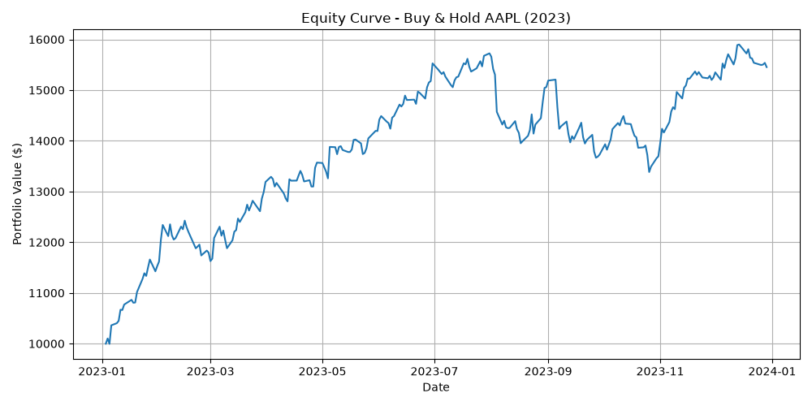

# Custom Backtesting Engine & Strategy Lab

A backtesting engine built from scratch in Python — no `backtrader`, no `zipline`, no `bt`. The point isn't to reinvent those libraries, it's to actually understand what a backtester is doing under the hood: order execution, position tracking, and the risk metrics everyone quotes without knowing how they're computed.

This is part of a 5-project, 5-month portfolio. Project 1 was a neural network from scratch; this one moves into quant finance.

## Status

Week 3 complete. Full risk-metric suite (CAGR, Sharpe, Sortino, max drawdown) plus walk-forward validation across 4 market regimes. The project's central finding — that no single strategy dominates across all conditions — only became visible once testing expanded beyond one year. Week 4 (comparison dashboard, packaging, write-up) is next.

## Main finding: no strategy wins in every regime

Everything up through Day 14 was tested on a single year (AAPL, 2023 — a strong, steady uptrend), and in that one year, Buy & Hold beat every active strategy on every metric. Extending the test to 2020–2023 changes the conclusion substantially:

| Year | Regime | Best CAGR | Best Sharpe | Notable |
|---|---|---|---|---|
| 2020 | COVID crash + sharp recovery | Buy & Hold (19.3%) | Momentum Breakout (1.46) — nearly tied | Momentum genuinely competitive in a volatile, sharply-trending year |
| 2021 | Continued uptrend, high volatility | Buy & Hold (9.2%) | **Momentum Breakout (1.74)** | Momentum beats Buy & Hold on a risk-adjusted basis, with the smallest drawdown of any strategy that year |
| 2022 | Bear market | Every strategy lost money | **SMA Crossover (−0.06, least negative)** | SMA lost far less than Buy & Hold — its willingness to exit positions acted as real downside protection |
| 2023 | Steady, low-volatility uptrend | Buy & Hold (13.7%) | Buy & Hold (2.13) | Matches the single-year result from Days 11–14 |

**No single strategy wins across all four years.** Buy & Hold's advantage is specific to steady, low-volatility uptrends (2021, 2023). Momentum Breakout is strong in volatile, sharply-trending conditions (2020–2021) despite being the weakest strategy overall in the 2023-only comparison. SMA Crossover's defensive character, visible in its small drawdown in the single-year test, becomes a real advantage in an actual down year (2022), where every other strategy lost more money.

This is a genuinely different, more defensible conclusion than "Buy & Hold is best" — it's regime-dependent, and being able to show *which* regime favors *which* strategy, with real numbers, is a stronger result than declaring a single winner.

**Known limitation of this walk-forward test:** each yearly window is run independently, starting fresh — a strategy needing indicator history (SMA's 50-day window especially) loses signal capability for the first stretch of *every* year, since indicator history doesn't carry over from the prior year's data. This likely slightly understates strategies with longer lookback windows, particularly visible in weaker 2020 SMA numbers. A continuous multi-year backtest (not yet built) would remove this artifact.

## Full single-year results (AAPL, 2023, for reference)

$10,000 starting cash, $1 commission/trade, 0.1% slippage/trade, 25% position sizing.

| Strategy | Final Value | CAGR | Sharpe | Sortino | Max Drawdown | Trades |
|---|---|---|---|---|---|---|
| Buy & Hold | $11,343.23 | 13.68% | 2.13 | 3.31 | −5.07% | 1 |
| SMA Crossover (20/50) | $10,488.97 | 4.96% | 2.03 | 3.50 | −1.16% | 8 |
| RSI Mean-Reversion (14, 30/70) | $10,263.94 | 2.68% | 1.25 | 1.92 | −1.87% | 4 |
| Momentum Breakout (20-day) | $10,232.34 | 2.36% | 0.56 | 0.83 | −5.99% | 7 |



## What's built so far

- **`engine/data_loader.py`** — pulls daily OHLCV data via `yfinance`, caches it locally as CSV. Cache filenames include the date range, not just the ticker, after a real bug where a stale single-year cache silently got reused for a 4-year walk-forward request.
- **`engine/order.py`** — validated trade instruction (dataclass).
- **`engine/portfolio.py`** — cash, positions, trade log, and total value tracking.
- **`engine/broker.py`** — validates and executes orders, models slippage alongside a flat commission.
- **`engine/backtester.py`** — the event loop, with a `prepare_fn` hook for indicators and a `slippage_pct` parameter.
- **`engine/position_sizing.py`** — caps each trade to a fixed percentage of available cash.
- **`engine/metrics.py`** — `to_return_series()`, `calculate_cagr()`, `calculate_sharpe()`, `calculate_sortino()`, `calculate_max_drawdown()`.
- **`engine/walk_forward.py`** — splits multi-year price data into yearly windows and runs every strategy on every window independently, producing a full regime-by-regime comparison instead of one number per strategy.
- **`strategies/buy_and_hold.py`**, **`sma_crossover.py`**, **`rsi_strategy.py`**, **`momentum_breakout.py`** — 4 strategies, all using shared position sizing.

Bugs hit and fixed across sessions: multiple typos, a missing `()` on `.pct_change`, a stray autocomplete import, a 0-byte unsaved file, a dict key naming mismatch, and the cache-collision bug above — caught because the walk-forward output showed only one year of results instead of four, not because it looked visually wrong.

## Tickers

SPY, AAPL, MSFT, GOOGL, JPM planned. So far AAPL is the only one actually tested, across 2020–2023.

## Setup

```bash
python -m venv venv
venv\Scripts\Activate.ps1   # Windows
pip install -r requirements.txt
python main.py
```

## Notes and derivations

`derivations.md` has photographed handwritten notes (finance terms, hand-worked calculations, architecture design, RSI, breakout `.shift(1)` reasoning, slippage, position sizing, CAGR, Sharpe, Sortino) paired with typed explanations, day by day.

## Why build the engine instead of using a library

Most student "algo trading" projects call `backtrader` or `zipline`, plot one equity curve, and call it done. That tests whether you can read documentation, not whether you understand what's happening between a signal and a filled trade — slippage, commissions, position sizing, what happens when you try to sell something you don't hold. Building it myself means I have to make those decisions explicitly instead of inheriting someone else's defaults.

## Known limitations (will grow as the project does)

- Walk-forward windows are independent, not chained — strategies with long lookback periods lose signal capability at the start of every window, understating their true multi-year performance
- Sharpe and Sortino use a risk-free rate / target of 0, not a real T-bill rate
- Position sizing is a fixed percentage of cash, not volatility-based
- Slippage model is a flat percentage, not dependent on order size or liquidity
- Single-asset backtests only — no portfolio-level diversification
- Only one ticker (AAPL) tested across the 4 walk-forward years — the other 4 tickers are cached-and-ready but untested
- RSI uses simple rolling averages, not Wilder's exponential smoothing
- The event loop is *designed* to avoid lookahead bias but hasn't been actively tested against it

## Roadmap

- **Week 1** ✅ complete — data layer, Order/Portfolio/Broker, event loop, buy-and-hold baseline, equity curve
- **Week 2** ✅ complete — SMA crossover, RSI mean-reversion, momentum breakout, slippage modeling, position sizing
- **Week 3** ✅ complete — CAGR, Sharpe, Sortino, max drawdown, walk-forward validation across 4 years. Main finding: no strategy dominates across all market regimes
- **Week 4**: comparison dashboard, packaging as a reusable module, write-up