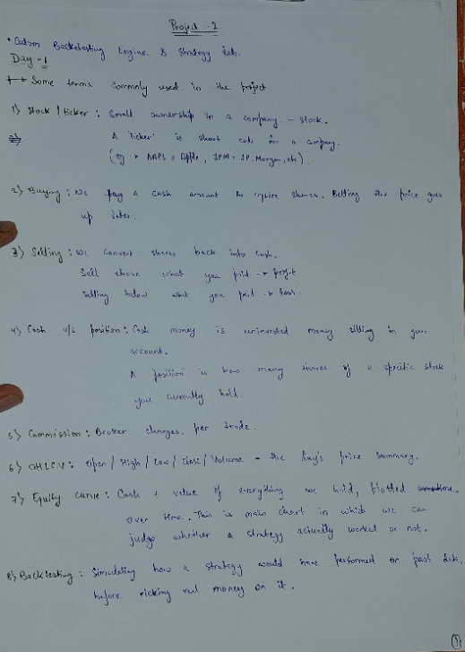
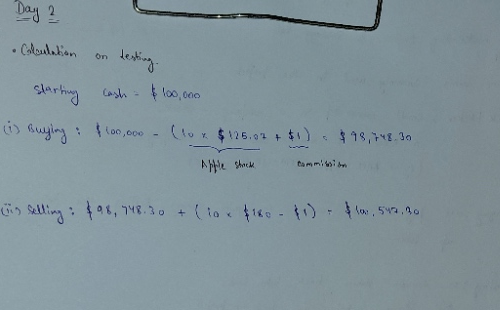

# Derivations & Notes

Handwritten notes from working through this project, day by day. Photos of the original page are paired with a typed version below each one.

---

## Day 1 — Finance basics

Some terms commonly used in this project:

1. **Stock / ticker** — Small ownership in a company → stock. A "ticker" is the short code for a company (e.g. AAPL = Apple, JPM = JPMorgan, etc.)
2. **Buying** — We pay a cash amount to acquire shares, betting the price goes up later.
3. **Selling** — We convert shares back into cash. Sell above what you paid → profit. Selling below what you paid → loss.
4. **Cash vs. Position** — Cash is uninvested money sitting in your account. A position is how many shares of a specific stock you currently hold.
5. **Commission** — Fee the broker charges per trade.
6. **OHLCV** — Open / High / Low / Close / Volume — the day's price summary.
7. **Equity curve** — Cash + value of everything held, plotted over time. This is the main chart used to judge whether a strategy actually worked or not.
8. **Backtesting** — Simulating how a strategy would have performed on past data, before risking real money on it.

---

## Day 2 — Portfolio buy/sell calculation

Worked through the exact numbers used to test the `Portfolio` class, starting from $100,000 cash:

**Buying** 10 AAPL shares @ $125.07, with $1 commission:

$100,000 − (10 × $125.07 + $1) = $98,748.30

**Selling** those same 10 AAPL shares later @ $180, with $1 commission:

$98,748.30 + (10 × $180 − $1) = $100,547.30

This matched the `Portfolio.update_on_fill()` output exactly when tested in `main.py`, confirming the cash/position math is correct.