# Derivations & Notes

Handwritten notes from working through this project, day by day. Photos of the original page are paired with a typed version below each one.

---

## Day 1 — Finance basics

Some terms commonly used in this project:

1. **Stock / ticker** — Small ownership in a company → stock. A "ticker" is the short code for a company (e.g. AAPL = Apple, JPM = JPMorgan, etc.)
2. **Buying** — We pay a cash amount to acquire shares, betting the price goes up later.
3. **Selling** — We convert shares back into cash. Sell above what you paid → profit. Selling below what you paid → loss.
4. **Cash vs. Position** — Cash is uninvested money sitting in your account. A position is how many shares of a specific stock you currently hold.
5. **Commission** — Fee the broker charges per trade.
6. **OHLCV** — Open / High / Low / Close / Volume — the day's price summary.
7. **Equity curve** — Cash + value of everything held, plotted over time. This is the main chart used to judge whether a strategy actually worked or not.
8. **Backtesting** — Simulating how a strategy would have performed on past data, before risking real money on it.

---

## Day 2 — Portfolio buy/sell calculation

Worked through the exact numbers used to test the `Portfolio` class, starting from $100,000 cash:

**Buying** 10 AAPL shares @ $125.07, with $1 commission:

$100,000 − (10 × $125.07 + $1) = $98,748.30

**Selling** those same 10 AAPL shares later @ $180, with $1 commission:

$98,748.30 + (10 × $180 − $1) = $100,547.30

This matched the `Portfolio.update_on_fill()` output exactly when tested in `main.py`, confirming the cash/position math is correct.

## Day 4 — The event loop

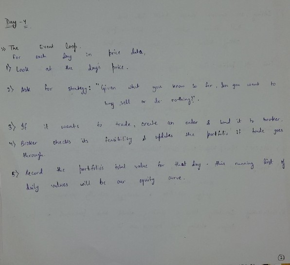

For each day in price data:

1. Look at the day's price.
2. Ask the strategy: "Given what you know so far, do you want to buy, sell, or do nothing?"
3. If it wants to trade, create an order and hand it to the broker.
4. Broker checks feasibility and updates the portfolio if the trade goes through.
5. Record the portfolio's total value for that day — this running list of daily values will be our equity curve.

This is the design that became `engine/backtester.py` — implemented directly from this outline, one step per line above mapping to one part of the loop.

## Day 6 — SMA crossover strategy

**Moving average (SMA):** instead of looking at a single day's closing price, average the last N days. A 20-day SMA on any given day = average of that day's close and the previous 19. Smooths out daily noise and shows the underlying trend.

**Crossover idea:** track 2 moving averages of different lengths — a fast one (e.g. 20-day) and a slow one (e.g. 50-day).
- Fast average crosses above slow average → recent prices rising faster than the longer-term trend → buy signal.
- Fast average crosses below slow average → recent momentum weakening relative to the trend → sell signal.

Called a "golden cross" (bullish) / "death cross" (bearish) when using 50-day and 200-day averages specifically.

**Why it's not guaranteed to work:** moving averages are lagging indicators — they only tell us about a trend after it's already partway underway. In a choppy, sideways market, this strategy can generate a lot of false signals (buy, then immediately get a sell signal a few days later, losing a bit to commission each time).

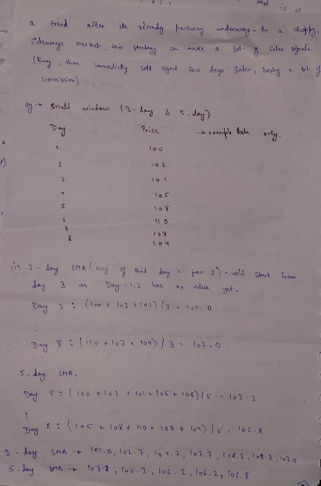

Worked a small example with 3-day and 5-day windows (instead of 20/50) to compute by hand:

| Day | Price |
|---|---|
| 1 | 100 |
| 2 | 102 |
| 3 | 101 |
| 4 | 105 |
| 5 | 108 |
| 6 | 110 |
| 7 | 107 |
| 8 | 104 |

3-day SMA starts from Day 3 (Days 1–2 have no value yet): 101.0, 102.7, 104.7, 107.7, 108.3, 107.0

5-day SMA starts from Day 5: 103.2, 105.2, 106.2, 106.8

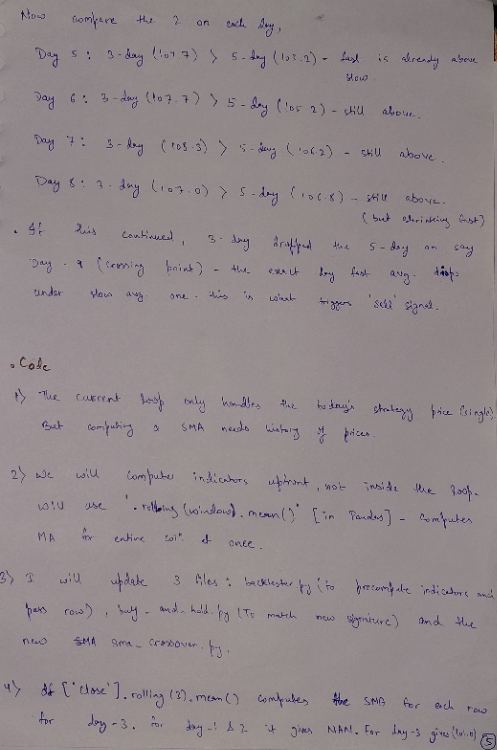

Comparing the two each day:
- Day 5: 3-day (104.7) > 5-day (103.2) — fast already above slow
- Day 6: 3-day (107.7) > 5-day (105.2) — still above
- Day 7: 3-day (108.3) > 5-day (106.2) — still above
- Day 8: 3-day (107.0) > 5-day (106.8) — still above, but gap shrinking

If this continued and the 3-day dropped below the 5-day on a later day, that exact crossing point is what triggers a sell signal.

**Code design notes:**
1. The event loop originally only handled today's single price, but computing an SMA needs price history.
2. Fix: compute indicators upfront, not inside the loop — use pandas `.rolling(window).mean()` to compute the moving average for the entire column at once.
3. Updated 3 files: `backtester.py` (to precompute indicators and pass the full row), `buy_and_hold.py` (to match the new signature), and the new `sma_crossover.py`.
4. `df["Close"].rolling(3).mean()` computes the SMA for each row — for Day 1–2 it gives `NaN` since there isn't enough history yet, for Day 3 onward it gives a real value.

## Day 7 — RSI mean-reversion

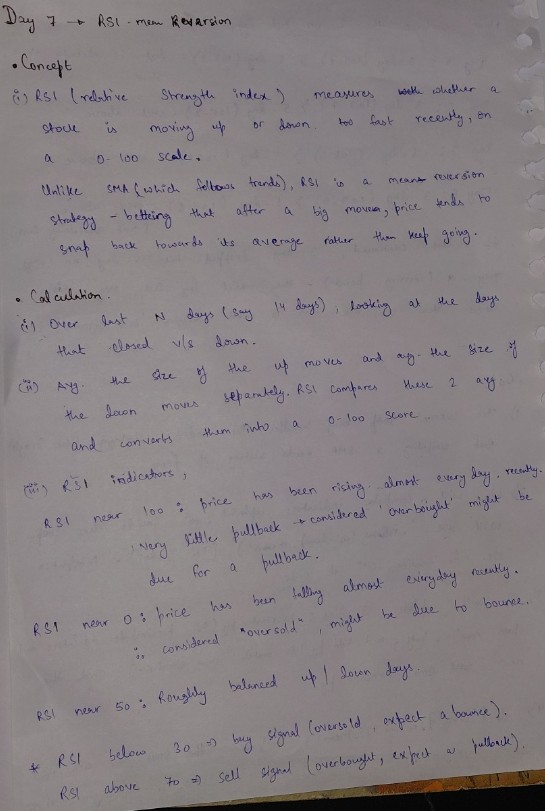

**Concept:** RSI (Relative Strength Index) measures whether a stock is moving up or down too fast recently, on a 0–100 scale. Unlike SMA (which follows trends), RSI is a mean-reversion strategy — betting that after a big move, price tends to snap back toward its average rather than keep going.

**Calculation, conceptually:** over the last N days (say 14), look at the days that closed up vs. down. Average the size of the up-moves and the down-moves separately. RSI compares these two averages and converts the result into a 0–100 score.

**RSI indicators:**
- RSI near 100: price has been rising almost every day recently, very little pullback — considered "overbought," might be due for a pullback.
- RSI near 0: price has been falling almost every day recently — considered "oversold," might be due to bounce.
- RSI near 50: roughly balanced up/down days.

Rule used: RSI below 30 → buy signal (oversold, expect a bounce). RSI above 70 → sell signal (overbought, expect a pullback).

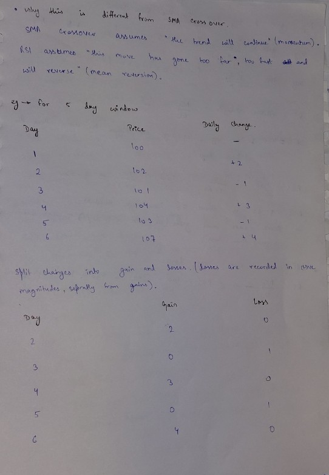

**Why this is different from SMA crossover:** SMA crossover assumes "the trend will continue" (momentum). RSI assumes "this move has gone too far, too fast, and will reverse" (mean reversion).

Worked a 5-day window example:

| Day | Price | Daily Change |
|---|---|---|
| 1 | 100 | — |
| 2 | 102 | +2 |
| 3 | 101 | −1 |
| 4 | 104 | +3 |
| 5 | 103 | −1 |
| 6 | 107 | +4 |

Split changes into gain and loss (losses recorded as positive magnitudes, separately from gains):

| Day | Gain | Loss |
|---|---|---|
| 2 | 2 | 0 |
| 3 | 0 | 1 |
| 4 | 3 | 0 |
| 5 | 0 | 1 |
| 6 | 4 | 0 |

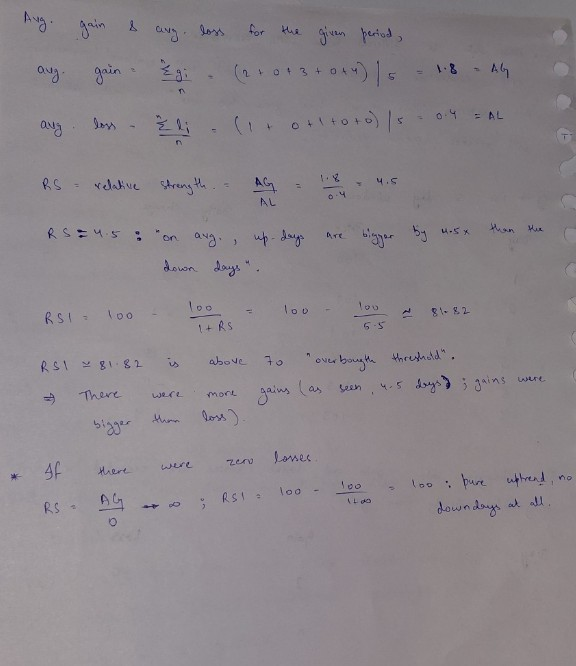

**Average gain and average loss over the period:**

Avg gain = (2+0+3+0+4)/5 = 1.8 = AG
Avg loss = (0+1+0+1+0)/5 = 0.4 = AL

**RS (Relative Strength)** = AG / AL = 1.8 / 0.4 = 4.5 — "on average, up-days are bigger by 4.5x than the down-days."

**RSI** = 100 − 100/(1 + RS) = 100 − 100/5.5 ≈ **81.82**

RSI ≈ 81.82 is above the 70 "overbought" threshold → there were more gains (4 of 5 days), and gains were bigger than losses.

**Edge case:** if there were zero losses at all, RS = AG/0 → ∞, and RSI = 100 − 100/(1+∞) = 100. This represents a pure uptrend with no down-days at all — the formula naturally bounds itself between 0 and 100 regardless of the actual size of price changes, which is what makes it comparable across different stocks and time periods.

This maps directly to `strategies/rsi_strategy.py`: `avg_gain`/`avg_loss` are the AG/AL from this table, computed with `.rolling(period).mean()` instead of by hand, and `Buy_Signal`/`Sell_Signal` implement the 30/70 threshold rule above.

## Day 8 — Momentum breakout

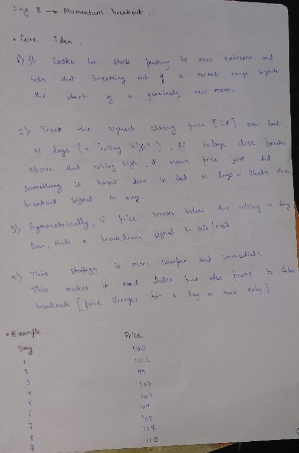

**Core idea:**
1. Looks for stocks pushing to new extremes and bets that breaking out of a recent range signals the start of a genuinely new move.
2. Track the highest closing price (Close) over the last N days (a "rolling high"). If today's close breaks above that rolling high, it means price just did something it hasn't done in the last N days — that's the breakout signal to buy.
3. Symmetrically, if price breaks below the rolling N-day low, that's a breakdown signal to exit.
4. This strategy is sharper and more immediate than SMA crossover. This makes it react faster, but also prone to false breakouts (price changes for a day or two only).

**Example:**

| Day | Price |
|---|---|
| 1 | 100 |
| 2 | 102 |
| 3 | 99 |
| 4 | 103 |
| 5 | 101 |
| 6 | 104 |
| 7 | 102 |
| 8 | 105 |
| 9 | 110 |

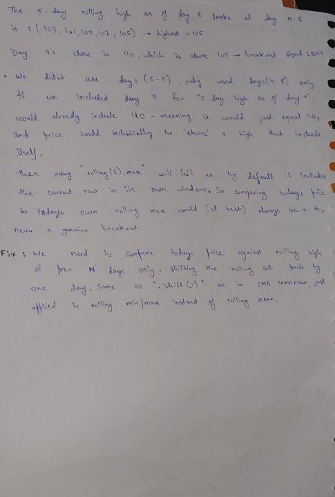

The 5-day rolling high as of Day 8 looks at Days 4–8: (103, 101, 104, 102, 105) → highest = 105.

Day 9's close is 110, which is above 105 → breakout signal: buy.

We didn't use Days (5–9), only Days (4–8). If we included Day 9 for the "5-day high as of Day 9," it would already include 110 — meaning it would just equal 110, and price could technically never be "above" a high that includes itself.

Then, using `.rolling(5).max()` will fail, as by default it includes the current row in its own window, so comparing today's price to today's own rolling max would (at best) always be a tie, never a genuine breakout.

**Fix:** we need to compare today's price against the rolling high of the previous N days only — shifting the rolling calculation back by one day. Same as `.shift(1)` in SMA crossover, just applied to rolling min/max instead of rolling mean.

This maps directly to `strategies/momentum_breakout.py`: `df["Close"].shift(1).rolling(window).max()` implements exactly this fix.

## Day 9 — Transaction costs (slippage)

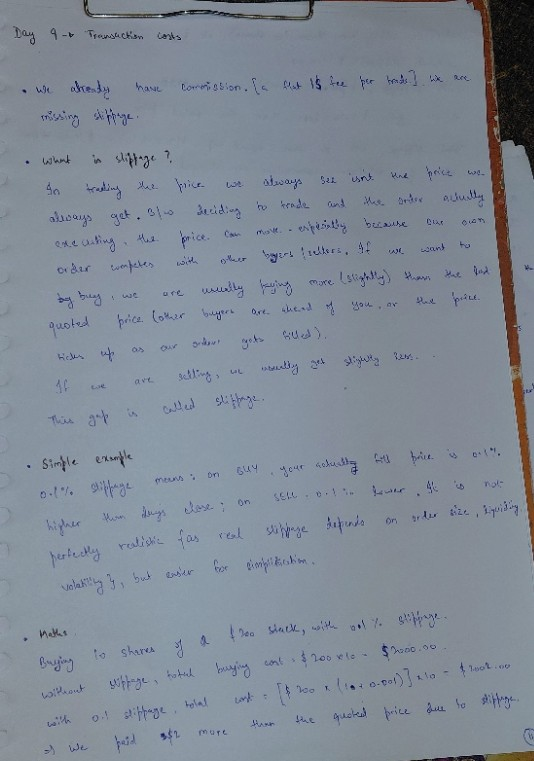

We already have commission (a flat $1 fee per trade). We are missing slippage.

**What is slippage?** In trading, the price we always see isn't the price we always get. Between deciding to trade and the order actually executing, the price can move — especially because our own order competes with other buyers/sellers. If we want to buy, we are usually buying more (slightly) than the last quoted price (other buyers are ahead of us, or the price ticks up as our order gets filled). If we are selling, we usually get slightly less. This gap is called slippage.

**Simple example:** 0.1% slippage means: on a BUY, our actual fill price is 0.1% higher than the day's close; on a SELL, 0.1% lower. It is not perfectly realistic (real slippage depends on order size, liquidity, volatility), but easier for simplification.

**Numbers:** buying 10 shares of a $200 stock, with 0.1% slippage.
- Without slippage, total buying cost: $200 × 10 = $2,000.00
- With 0.1% slippage, total cost: [$200 × (1 + 0.001)] × 10 = $2,002.00
- We paid $2 more than the quoted price due to slippage.

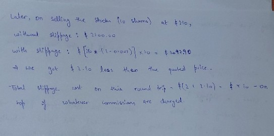

Later, on selling the stocks (10 shares) at $210:
- Without slippage: $2,100.00
- With slippage: [$210 × (1 − 0.001)] × 10 = $2,097.90
- We got $2.10 less than the quoted price.

**Total slippage cost on this round trip:** $(2 + 2.10) = $4.10 — on top of whatever commissions are charged.

This maps directly to `engine/broker.py`: `_apply_slippage()` implements exactly this — multiplying the quoted price by `(1 + slippage_pct)` on a BUY and `(1 - slippage_pct)` on a SELL.

## Day 11 — Daily returns & CAGR

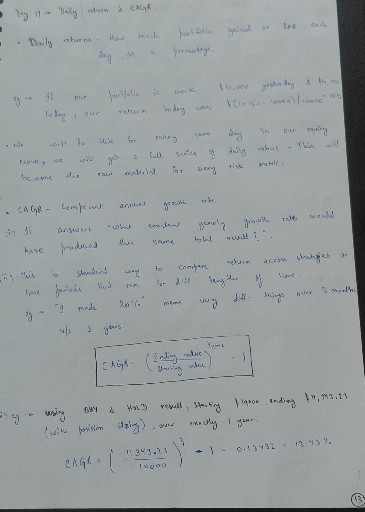

**Daily returns:** how much the portfolio gained or lost each day, as a percentage.

E.g. if our portfolio is worth $10,000 yesterday and $10,150 today, our return today was ($10,150 − $10,000)/$10,000 = 1.5%.

We will do this for every consecutive day in our equity curve — we will get a full series of daily returns. This will become the raw material for every risk metric.

**CAGR — Compound Annual Growth Rate:**
1. It answers "what constant yearly growth rate would have produced this same total result?"
2. This is the standard way to compare return across strategies or time periods that ran for different lengths of time. E.g. "I made 20%" means very different things over 3 months vs. 3 years.

$$CAGR = \left(\frac{\text{Ending value}}{\text{Starting value}}\right)^{1/\text{years}} - 1$$

E.g. using Buy & Hold result, starting $10,000, ending $11,343.23 (with position sizing), over exactly 1 year:

$$CAGR = \left(\frac{11{,}343.23}{10{,}000}\right)^{1/1} - 1 = 0.13432 = 13.43\%$$

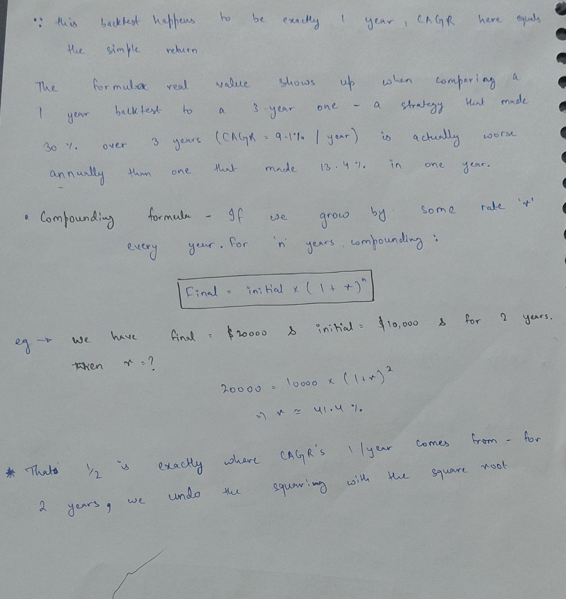

Since this backtest happens to be exactly 1 year, CAGR here equals the simple return.

The formula's real value shows up when comparing a 1-year backtest to a 3-year one — a strategy that made 30% over 3 years (CAGR = 9.1%/year) is actually worse annually than one that made 13.4% in one year.

**Compounding formula** — if we grow by some rate `r` every year, for `n` years, compounding:

$$\text{Final} = \text{Initial} \times (1+r)^n$$

E.g. we have Final = $20,000 and Initial = $10,000 for 2 years. Then r = ?

$$20{,}000 = 10{,}000 \times (1+r)^2 \implies r \approx 41.4\%$$

That's exactly where CAGR's `1/year` comes from — for 2 years, we undo the squaring with the square root.

This maps directly to `engine/metrics.py`: `to_returns_series()` implements the daily-return formula via `.pct_change()`, and `calculate_cagr()` implements this exact formula, with `years` computed from the actual date span of the equity curve.

## Day 12 — Sharpe ratio

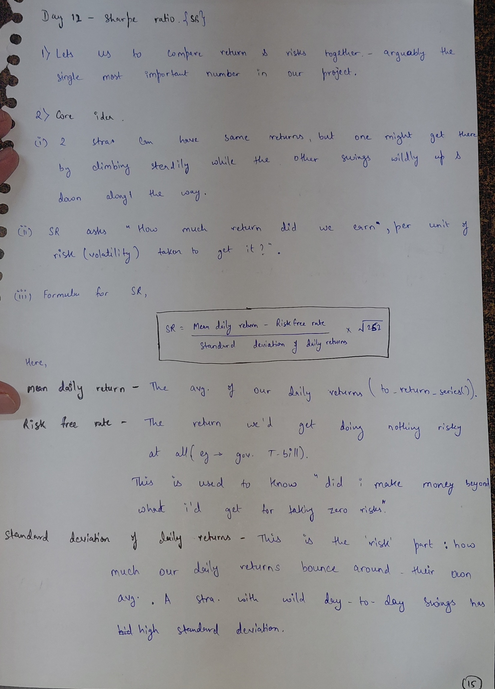

1. Lets us compare return and risk together — arguably the single most important number in our project.
2. Core idea:
   (i) 2 strategies can have the same returns, but one might get there by climbing steadily while the other swings wildly up and down along the way.
   (ii) SR asks "How much return did we earn, per unit of risk (volatility) taken to get it?"
   (iii) Formula for SR:

$$SR = \frac{\text{Mean daily return} - \text{Risk free rate}}{\text{Standard deviation of daily returns}} \times \sqrt{252}$$

Here:
- **Mean daily return** — the average of our daily returns (`to_return_series()`).
- **Risk free rate** — the return we'd get doing nothing risky at all (e.g. gov. T-bill). This is used to know "did I make money beyond what I'd get for taking zero risk."
- **Standard deviation of daily returns** — this is the "risk" part: how much our daily returns bounce around their own average. A strategy with wild day-to-day swings has high standard deviation.

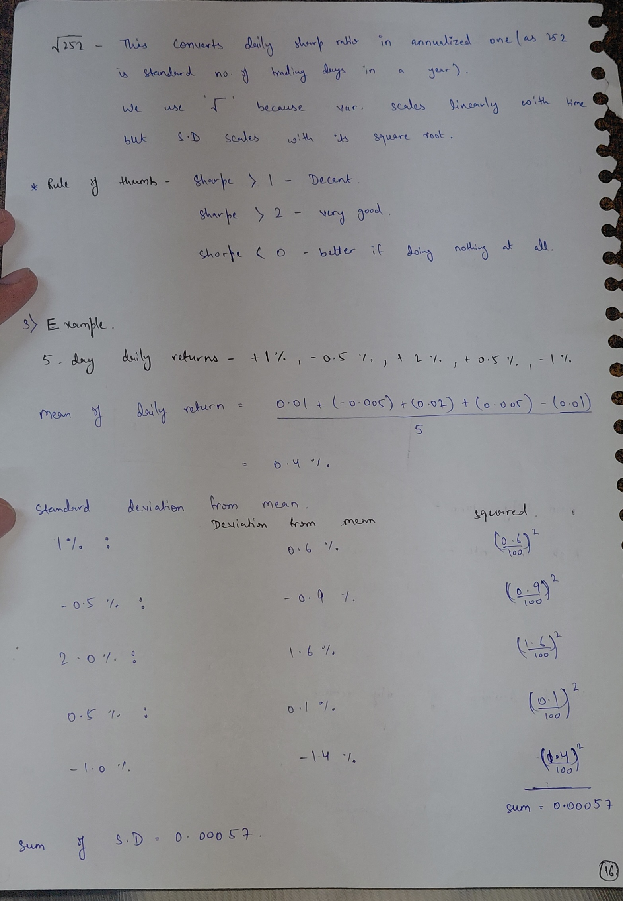

`√252` — this converts daily Sharpe ratio into an annualized one (as 252 is standard no. of trading days in a year). We use `√` because variance scales linearly with time but standard deviation scales with its square root.

**Rule of thumb:** Sharpe > 1 — decent. Sharpe > 2 — very good. Sharpe < 0 — better if doing nothing at all.

**Example:** 5-day daily returns: +1%, −0.5%, +2%, +0.5%, −1%

Mean of daily return = (0.01 + (−0.005) + (0.02) + (0.005) − (0.01)) / 5 = 0.4%

Standard deviation from mean:

| Return | Deviation from mean | Squared |
|---|---|---|
| 1% | 0.6% | (0.6/100)² |
| −0.5% | −0.9% | (0.9/100)² |
| 2.0% | 1.6% | (1.6/100)² |
| 0.5% | 0.1% | (0.1/100)² |
| −1.0% | −1.4% | (1.4/100)² |

Sum of S.D = 0.00057

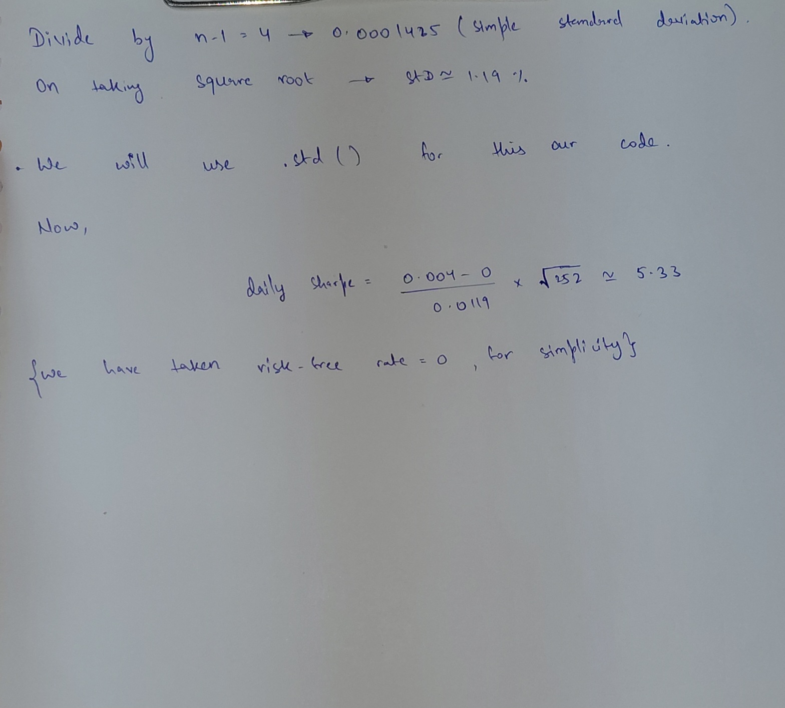

Divide by n−1 = 4 → 0.0001425 (simple standard deviation). On taking square root → std ≈ 1.19%.

We will use `.std()` for this in our code.

Now,

$$\text{daily Sharpe} = \frac{0.004 - 0}{0.0119} \times \sqrt{252} \approx 5.33$$

(we have taken risk-free rate = 0, for simplicity)

This maps directly to `engine/metrics.py`: `calculate_sharpe()` implements exactly this — `daily_returns.mean()` and `daily_returns.std()` from `to_return_series()`, subtracting the risk-free rate (0), then multiplying by `np.sqrt(252)` to annualize.day12_3_sharpe_calc